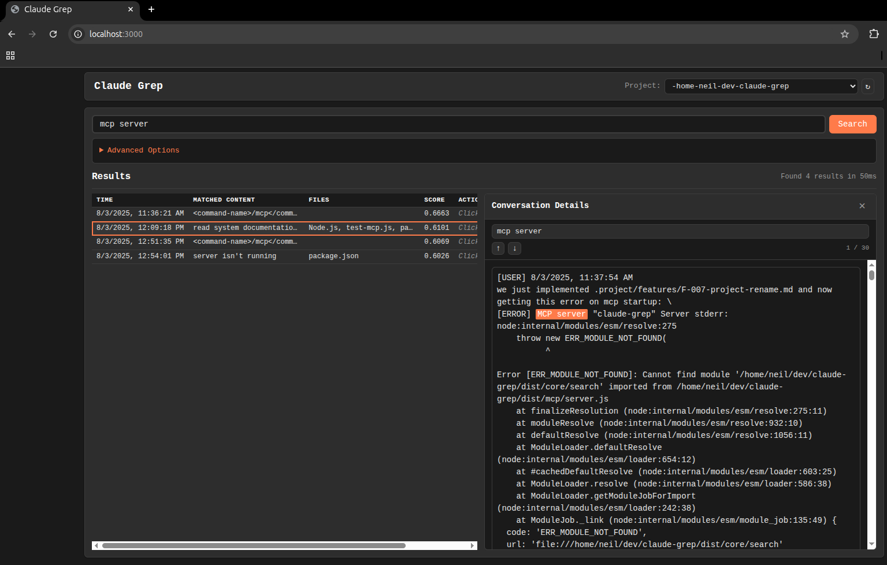

# Claude Grep

Grep-like tool for searching Claude conversation history with powerful filtering, multiple output formats, and project-aware context.



## Features

- **Comprehensive Search**: Find conversations by keywords, files, errors, or patterns
- **Multiple Output Formats**: Table, list, CSV, markdown, JSON
- **Project Context**: Automatically limits searches to current project
- **Drill-down Capability**: View full conversations with context
- **Exhaustive Mode**: Deep search that prioritizes completeness
- **MCP Integration**: Works seamlessly with Claude Desktop

## Installation

```bash
npm install -g claude-grep
```

For Claude Desktop integration, add to your MCP settings:

```json
{
  "mcpServers": {
    "claude-grep": {
      "command": "npx",
      "args": ["claude-grep", "mcp"]
    }
  }
}
```

## Quick Start

### CLI Usage

```bash
# Search for a keyword
claude-grep search "TypeError"

# Search with table output (default)
claude-grep search "async function" --format table

# Search in specific project
claude-grep search "bug fix" --project my-project

# Exhaustive search (slower but complete)
claude-grep search "edge case" --exhaustive
```


### In Claude Desktop

After MCP setup, use these commands in Claude:

- Search: "search for conversations about TypeScript errors"
- Files: "find when I last edited package.json"
- Drill-down: "show me the full conversation about that bug fix"

## Output Formats

### Table Format (Default)
```
Session               Time          Match Preview                    Files
4dK92La_conversati... 17 hours ago  ...dealing with TypeScript err... src/types.ts, src/index.ts
9mN31Pb_conversati... 2 days ago    ...fixed the async/await issue... lib/async.js
```

### List Format
```
1. Session 4dK92La (17 hours ago)
   Files: src/types.ts, src/index.ts
   Match: "...when dealing with TypeScript errors in the..."
   
2. Session 9mN31Pb (2 days ago)
   Files: lib/async.js
   Match: "...successfully fixed the async/await issue by..."
```

## Advanced Usage

### Web UI

Launch the web interface for visual search:

```bash
# Start web server on default port (3000)
claude-grep web

# Start on custom port
claude-grep web --port 8080

# Start without opening browser
claude-grep web --no-open
```

The web interface provides:
- Real-time search with live results
- Project switching
- Conversation drill-down with in-conversation search
- Multiple output format support
- Claude-inspired dark theme


**Security Note**: The web server is designed for local use only. Your conversation data never leaves your machine. Do not expose the web server to the internet as it does not include authentication.

### Persistent Preferences

Set your default output format:

```bash
claude-grep config set format markdown
```

## Development

```bash
# Clone the repository
git clone https://github.com/iamneilroberts/claude-grep.git
cd claude-grep

# Install dependencies
npm install

# Run in development mode
npm run dev

# Run tests
npm test
```

## License

MIT